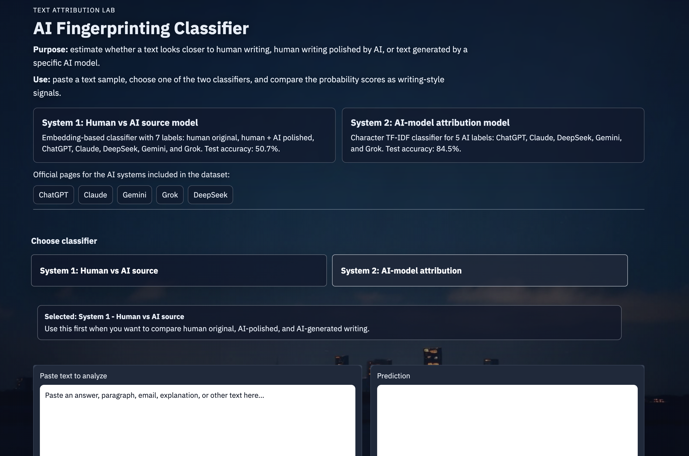
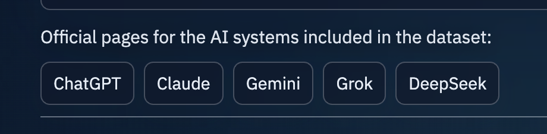
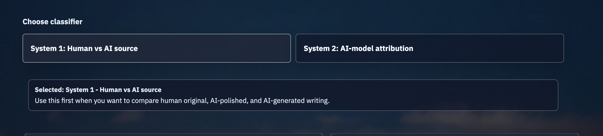
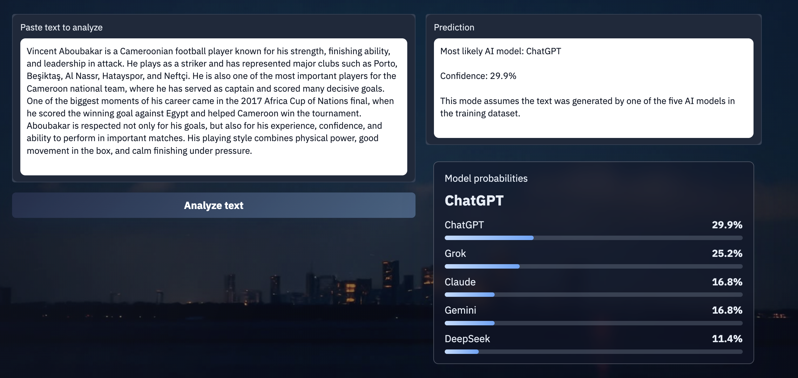
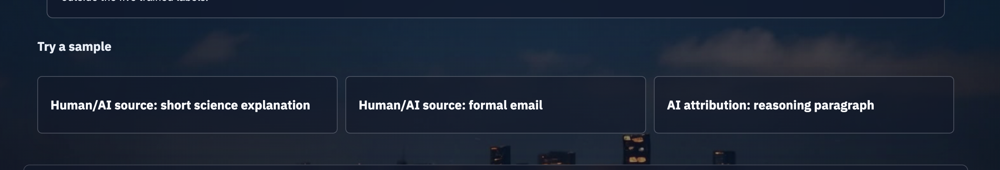

# AI Fingerprinting Classifier

AI Fingerprinting Classifier is a text-classification project that explores whether writing samples can be classified by source. The project uses a custom dataset containing responses from several AI systems, human-written answers, and human answers polished with AI.

The main assignment goal is covered by an embedding-based classifier trained on a custom dataset. The project also includes an extension model for AI-only attribution, where the app estimates which AI model a text most closely resembles.

## Project Goal

The problem is to classify generated or written text based on writing-style signals. The project investigates two related tasks:

1. **Human vs AI source classification**  
   This classifier compares seven labels: `human_original`, `human_ai_polished`, `chatgpt`, `claude`, `deepseek`, `gemini`, and `grok`.

2. **AI-model attribution**  
   This classifier compares five AI model labels: `chatgpt`, `claude`, `deepseek`, `gemini`, and `grok`.

The first model is the core assignment model because it uses embeddings and includes human/AI classes. The second model is an additional experiment that achieved stronger performance for distinguishing between AI systems.

## Demo Screenshots

### 1. App Overview



This screen introduces the application. The top section explains the project purpose, how to use the demo, and the two classifier systems. The two model cards summarize the difference between the embedding-based human/AI source classifier and the AI-only attribution classifier.

### 2. Official AI System Links



These links point to the official web pages for the AI systems included in the dataset. They are included so users can understand which systems the model labels refer to: ChatGPT, Claude, Gemini, Grok, and DeepSeek.

### 3. Classifier Selection



This section lets the user choose which classifier to run. The selected system panel explains what the chosen model is intended for. System 1 is broader and compares human, AI-polished, and AI-generated text. System 2 is narrower and focuses only on identifying which AI model a text most resembles.

### 4. Prediction Output



This screen shows the main interaction flow. The user pastes text on the left, clicks **Analyze text**, and receives a prediction on the right. The probability panel shows the most likely classes and their confidence scores.

### 5. Sample Inputs



The sample section provides quick examples for testing the app. Each sample automatically fills the text box and selects the appropriate classifier, making the demo easier to understand without needing to invent a test input.

## Dataset

The project uses a custom text-classification dataset collected from prompts answered by multiple sources.

### Main Dataset

The main dataset contains:

- ChatGPT responses
- Claude responses
- Gemini responses
- Grok responses
- DeepSeek responses
- Human-written responses
- Human-written responses polished with AI

Files:

```text
data/raw/ai_fingerprinting_dataset.csv
data/processed/train.csv
data/processed/test.csv
```

### AI-Only Extension Dataset

The v2 dataset expands the AI-model attribution task with additional prompts and AI-only responses.

Files:

```text
data/raw/ai_fingerprinting_dataset_v2.csv
data/processed/train_v2.csv
data/processed/test_v2.csv
```

## Models

### Embedding-Based Classifier

The main classifier uses sentence embeddings from:

```text
sentence-transformers/all-MiniLM-L6-v2
```

Several classifiers were trained and evaluated, including Logistic Regression, Linear SVM, Random Forest, and MLP.

### AI-Only TF-IDF Classifier

The strongest AI-only attribution model uses character n-gram TF-IDF features with a Linear SVM classifier. This model captures local writing patterns such as punctuation, formatting habits, and repeated phrase patterns.

## Results

| Experiment | Best model | Accuracy | Macro F1 | Random baseline |
|---|---:|---:|---:|---:|
| Main 7-class source classifier | MLP classifier | 50.71% | 50.54% | 14.29% |
| AI-only embedding attribution | Logistic Regression | 47.50% | 47.30% | 20.00% |
| AI-only TF-IDF attribution | Character TF-IDF + Linear SVM | 84.50% | 84.40% | 20.00% |

The full results are saved in:

```text
results/all_results_summary.md
results/all_results_summary.csv
```

## How To Run Locally

Clone the repository and enter the project folder:

```bash
git clone YOUR_REPOSITORY_URL
cd ai-fingerprint
```

Create and activate an environment:

```bash
conda create -n ai-fingerprint python=3.11
conda activate ai-fingerprint
```

Install dependencies:

```bash
pip install -r requirements.txt
```

Run the Gradio app:

```bash
python app.py
```

The app should open automatically in the browser. If it does not, open:

```text
http://127.0.0.1:7860
```

## Project Structure

```text
ai-fingerprint/
├── app.py
├── app/
│   ├── app.py
│   ├── requirements.txt
│   └── assets/
├── assets/
│   └── screenshots/
├── data/
│   ├── raw/
│   └── processed/
├── models/
├── report/
├── results/
├── src/
├── README.md
└── requirements.txt
```

## Limitations

This project should not be interpreted as proof of authorship. The models learn patterns from the collected dataset, and predictions can be unreliable for:

- very short texts
- heavily edited or paraphrased text
- translated text
- topics outside the training data
- future versions of the AI systems
- AI models not included in the dataset

The demo should be understood as a writing-style signal classifier, not a definitive AI detector.

## AI Tool Use Reflection

AI tools were used to support coding, dataset preparation, debugging, interface design, and report/README drafting. The most useful part was rapid iteration: model training, Gradio interface updates, and result interpretation could be improved quickly. However, the outputs still required manual checking because AI tools can hallucinate code behavior, file paths, and interpretations. The project reinforced that AI tools are helpful for acceleration, but the developer still needs to understand the dataset, verify results, and explain the limitations clearly.

## Links

Add these links before submission:

```text
Hugging Face dataset:
Hugging Face demo:
```
